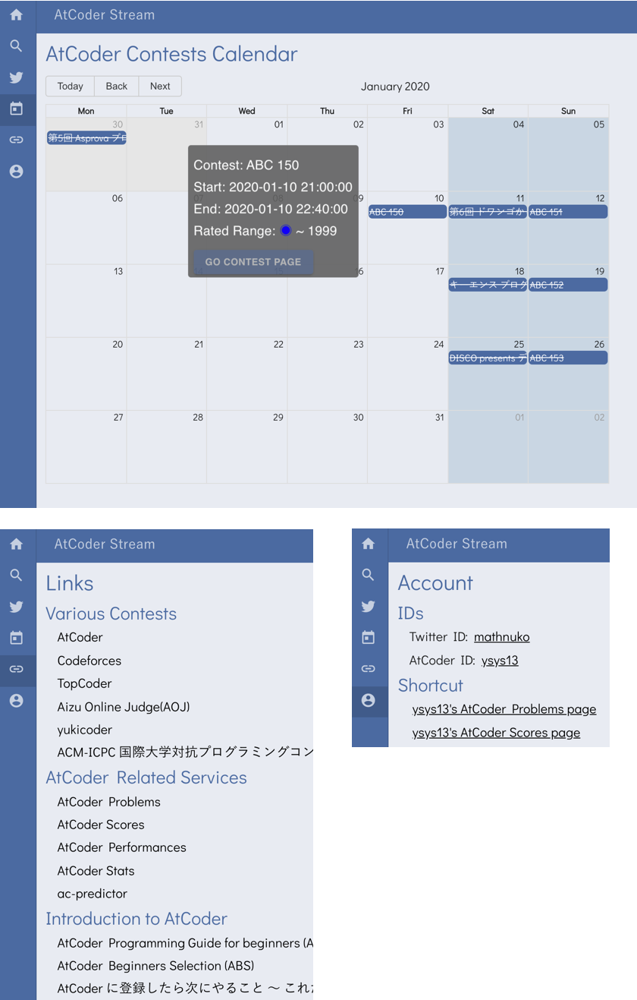

<!--
class: title
_paginate: false
-->

# AtCoder Stream

## AtCoder を支えるツールとしての Twitter

### 技育展 - 無駄開発（2020/09/26）

### Yosuke Okuwaki

<!--
セクションの時間 (累積)
10 sec (10 sec)

「AtCoder Stream、AtCoder を支えるツールとしての Twitter」、というタイトルで発表します。よろしくお願いします。
-->

---

<!--
class: content
-->

# トーク内容

1. プロフィール
2. AtCoder Stream とは：ざっくり
3. AtCoder とは
4. AtCoder を取り巻く環境
5. AtCoder Stream とは

<!--
10 sec (30 sec)

本日のトーク内容です。

まず、私が開発している AtCoder Stream という Web アプリケーションについて簡単に説明し、その後、開発の経緯やアプリケーションの機能を説明していきます。サービス自体は公開していません。
-->

---

# プロフィール

- ハンドルネーム
  - pyteyon
- 所属
  - 東京大学大学院 理学系研究科 生物科学専攻 M2
- 各種アカウント
  - GitHub：https://github.com/nukopy
  - Twitter：@pyteyon
  - AtCoder：ysys13 緑コーダー（highest 912）

<!--
15 sec (45 sec)

私のプロフィールです。

- ネット上では pyteyon というハンドルネームで活動してます。
- 良かったら GitHub、Twitter 等フォローお願いします！
-->

---

# AtCoder Stream とは：ざっくり

- **AtCoder** と **Twitter** を連携させる Web アプリケーション
- AtCoder ユーザのツイートを収集し、AtCoder に関する知見を簡単に検索できるようにする

<!--
15 sec (60 sec)

AtCoder Stream についてざっくり説明します。

- **AtCoder** と **Twitter** を連携させる Web アプリケーション
- AtCoder ユーザのツイートを収集し、AtCoder に関する知見を簡単に検索できるようにする

それでは、AtCoder Stream について詳しく説明していきます。
-->

---

<!--
_class: title
_paginate: false
-->

# 3. AtCoder とは

<!--
まず、前提知識として、AtCoder というサービスについて簡単に説明します。
-->

---

<!--
_layout: two-columns
-->

# AtCoder とは

- **AtCoder**（あっとこーだー）
  - HP：[atcoder.jp](https://atcoder.jp)
  - **競技プログラミングコンテストの企画、運営を行うサービス**
  - 主なサービス内容
    - 毎週末に開催されるリアルタイムのオンラインコンテストで競い合える
    - 3,000 以上の過去問にいつでもチャレンジできる
    - プログラミング初学者向け教育コンテンツの提供：[APG4B](https://atcoder.jp/contests/APG4b)
    - ソフトウェアエンジニアの採用支援：[AtCoderJobs](https://jobs.atcoder.jp/)

<!--  -->

引用元：[AtCoder 公式 HP](https://atcoder.jp)

<!-- 15 sec

AtCoder は、競技プログラミングコンテストの企画、運営を行うサービスです。
リアルタイムで行われるオンラインコンテストやその過去問を解くというコンテンツがメインとなり、その他にもプログラミング教材やソフトウェアエンジニアの採用支援なども行っています。

-->

---

# AtCoder とは - オンラインコンテスト

<!--
AtCoder で開催されるオンラインコンテストがどういうものかを説明した図が以下になります。
コンテスト開始時間になったら問題が複数与えられ、それぞれについてのプログラムを書きます。それをブラウザから提出すると、AtCoder が自動採点してくれます。
そして、問題の解く早さに寄り順位付けを行い、最後に今までの戦績を考慮したレーティングと呼ばれる数値でランク付けが行われます。
-->

引用元：[東京工業大学デジタル創作同好会 traP のブログ記事](https://trap.jp/post/660/)

---

<!--
_class: title
_paginate: false
-->

# 4. AtCoder を取り巻く環境

<!--
続いて、AtCoder というサービスを取り巻く環境について、AtCoder Stream の開発に至った経緯に触れつつお話しします。
-->

---

# AtCoder を支えるサービス

- **Twitter**
- **AtCoder 関連サービス**
  - AtCoder Problems
    - コンテストの問題の解答状況、問題の難易度の表示、バーチャルコンテストへの参加
  - AtCoder Scores
    - 問題を点数順に並べた上での解答状況の管理
  - ac-predictor
    - コンテストの順位、レーティング変動の予測
  - ...

上記以外にも AtCoder を支える多くのサービス、ツールが有志によって開発されている

<!--

AtCoder はコミュニティ、そして多くのサービスによって支えられています。
特に有用なものとして、Twitter や有志の方々が開発しているサービス・ツールがあります。
-->

---

# AtCoder と Twitter の関係

## AtCoder ユーザには、

## Twitter ユーザが多い

- Twitter が競技プログラミングをやる人にとっての議論、知識共有の場として働いている
- コンテスト後に、問題やアルゴリズムに関するツイートやブログ記事をタイムラインに垂れ流してくれる（左図）

Twitter における AtCoder ユーザの様子

<!--
特に、Twitter は大きな役割を果たしています。
多くの AtCoder ユーザが Twitter ユーザであり、Twitter が、コンテストを含めた競プロに関する議論や知識共有の場となっています。
-->

---

# AtCoder Stream の開発に至った経緯

## AtCoder や Twitter について日頃感じていたこと

- 有益なツイートが多いのに、コンテストが終わったら情報はインターネットの海に飲まれてしまうのでもったいない
- 過去のコンテストの問題について調べるとき、Twitter で検索すると素早く欲しい情報を取得できる
- （Web が好きな人間として、AtCoder Problems のようなユーザが多く、愛されているサービスに憧れていた）

---

# AtCoder Stream の開発に至った経緯

## AtCoder と Twitter について日頃感じていたこと

- 有益なツイートが多いのに、コンテストが終わったら情報は一旦流されてしまうのでもったいない
- 過去のコンテストについて調べるとき、Twitter で検索すると素早く欲しい情報を取得できた
- 上記 2 点を上手くアプリケーションに落とし込めないか？
- （AtCoder Problems に憧れていた）

<h2 id="hirameki">競プロ er のツイートを収集して「AtCoder に特化した Twitter みたいなアプリ」作ればいいんじゃね？</h2>

<!--
そして、私が AtCoder Stream の開発に至った経緯ですが、

- コンテストが終わったら非常に有益な情報が一旦流れてしまうのでもったいないなと常々思っていて、。
- かつ、過去のコンテストの情報を調べるとき、Twitter で検索すると素早くブログ記事等の欲しい情報を取得できた
- この 2 点をアプリに落とし込めないかと考えた時に、競プロ er のツイートを収集するアプリという素朴なアイディアに至りました。

-->

---

<!--
_class: title
_paginate: false
-->

# 4. AtCoder Stream とは <!-- 3 min -->

<!--
ここまでの話を踏まえ、AtCoder Stream の機能を解説していきます。
-->

---

# AtCoder Stream とは（再掲）

- **AtCoder** と **Twitter** を連携させる Web アプリケーション
- AtCoder ユーザのツイートを収集し、AtCoder に関する知見を簡単に検索できるようにする

<!--
AtCoder Stream は、AtCoder と Twitter の連携アプリであり、AtCoder ユーザのツイートを収集し、知見を含んだツイートを簡単に検索できるようにします。
-->

---

# AtCoder Stream とは

---

# 主な機能

## コンテストに関する知見を効率的に検索

- **コンテスト毎のツイート検索機能**
  - 自分がフォローしている AtCoder
    ユーザのツイートを検索できる
- **ツイートの絞り込み機能**
  - AtCoder のレーティング（色）
  - ツイートの Like、RT 数
- **ツイートに含まれる外部リンクのランキング表示**
  - Like、RT 数の多い、（ブログ記事などの）外部リンクを抽出

<!--
具体的な機能を説明します。
ツイートを効率よく収集するために、シンプルな UI を実装しました。
自分が Twitter 上でフォローしている AtCoder のユーザを対象に、
レーティングやツイートの Like / RT 数で絞りこめます。
また、Like / RT 数の多いブログ記事のリンクを抽出し、ツイートとは別枠で表示します。
-->

---

# その他の機能

## AtCoder に関する情報を一箇所にまとめる

- **カレンダー**
  - AtCoder のコンテストカレンダー
- **リンク集**
  - 競技プログラミングに関する各種リンクまとめ
- **アカウント画面**
  - アカウント情報
  - AtCoder 関連サービスの "自分のアカウントページ" へ飛べる
    - AtCoder Problems
    - AtCoder Scores

<!--
その他の機能として、カレンダーや競技プログラミングに関する各種リンクをまとめなどを実装していきます。AtCoder に関する情報を一箇所にまとめ、情報を統合するプラットフォームのような機能を提供しています。

-->

---

# システムアーキテクチャ：全体像

<!--
アプリケーションの機能を紹介したので、最後に技術的な側面に少し触れたいと思います。今表示しているのがこのアプリのシステムアーキテクチャです。
-->

---

# SPA + API サーバ

## TypeScript/React + Python/Django

<!--
サーバサイド側がごちゃごちゃしてるように見えますが、中身は至ってシンプルで、フロントエンドが TypeScript/React による SPA（シングルページアプリケーション）、バックエンドが Python/Django による API サーバという、所謂 SPA + API サーバの構成です。
-->

---

# 実装の工夫点

## Pub/Sub システムによるクローリングのジョブ管理

<!--
実装の工夫点としては、Redis による Pub/Sub システムでクローリングジョブを管理していることが挙げられます。AtCoder のコンテストカレンダーを毎日定時でクローリングし、コンテスト情報の更新の有無をトリガーとした Pub/Sub システムでジョブのスケジューリングを自動化しています。
-->

---

# 技術スタック

- フロントエンド
  - TypeScript
  - ReactJS
  - ContextAPI
  - AWS
    - Amazon Route 53
    - Amazon S3
    - Amazon CloudFront

- バックエンド
  - Web サーバ
    - Nginx
  - AP サーバ
    - Python
    - Django/Django REST Framework
    - Gunicorn
  - DB
    - PostgreSQL
    - Redis
  - ミドルウェア
    - Redis（メッセージブローカー）
    - Celery（メッセージワーカー）

<!--
10 sec

アプリケーションの技術スタックを列挙しておきました。アーキテクチャ図と比較しながら参照してみてください。
-->

---

<!--
_class: title
_paginate: false
-->

# 終わりに

<!--
終わりに、ということで、
-->

---

# 終わりに

- URL
  - AtCoder Stream: https://atcoder-stream.com
- ソースコード
  - GitHub 上にソースコードを公開しています。セキュリティの都合等で非公開にする場合もあります。
  - [github.com/nukopy/AtCoderStream](https://github.com/nukopy/AtCoderStream)

## AtCoder Stream を開発するきっかけになった AtCoder、AtCoder Problems の開発者の方々や、Twitter で度々お世話になっている競プロ er の皆様にこの場をお借りしてお礼申し上げます
